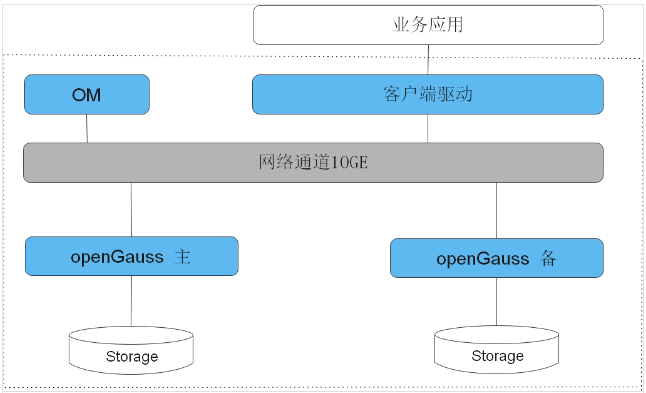
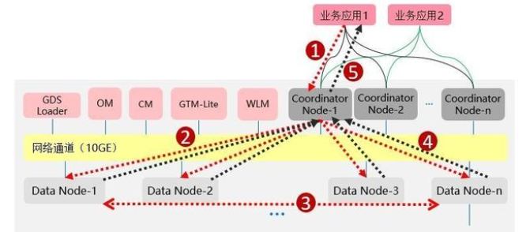
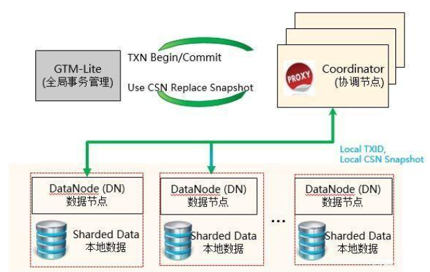
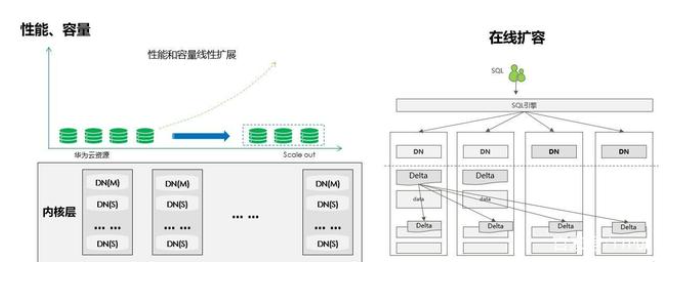

# openGauss

## 简介

- openGauss内核源自PostgreSQL，新一代企业级分布式数据库。
- openGauss版本规划按照6个月一个小版本，1年一个大版本的节奏，版本生命周期暂定3年。

## 核心特性

1. 高性能
   - 提供了面向多核架构的并发控制技术结合鲲鹏硬件优化，在两路鲲鹏下TPCC Benchmark达成性能150万tpmc。
   - 针对当前硬件多核NUMA的架构趋势，在内核关键结构上采用了Numa-Aware的数据结构。
   - 提供Sql-bypass智能快速引擎技术。
   - 针对频繁更新场景，提供Ustore存储引擎。
2. 高可用
   - 支持主备同步，异步以及级联备机多种部署模式。
   - 数据页CRC校验，损坏数据页通过备机自动修复。
   - 备机并行恢复，10秒内可升主提供服务。
   - 提供基于Paxos分布式一致性协议的日志复制及选主框架。
3. 高安全
   - 支持全密态计算，访问控制、加密认证、数据库审计、动态数据脱敏等安全特性，提供全方位端到端的数据安全保护。
4. 易运维
   - 基于AI的智能参数调优和索引推荐，提供AI自动参数推荐。
   - 慢SQL诊断，多维性能自监控视图，实时掌控系统的性能表现。
   - 提供在线自学习的SQL时间预测。
5. 全开放
   - 采用木兰宽松许可证协议，允许对代码自由修改，使用，引用。
   - 提供伙伴认证，培训体系和高校课程。

## 软件架构

- openGauss是单机系统，支持一主多备，最多支持八个备机。

## 部署模式

- 支持集中式和分布式两种部署形态

### 集中式部署

- 集中式部署又包括单机和主备两种类型。
- 以主备为例，支持1+2（最大保护）主备，基于数据库日志复制的热备，在单机性能可满足需求的情况下，提供高可用。
  - 1+1（最大可用）指的是，数据会同步写往备机。但如果出现网络等影响，无法完成同步操作，会转为异步。后续网络恢复，会自动追上。在数据不同步期间，切换会有数据丢失。
  - 1+2（最大保护）则意味着数据会同步写往备机，且要求必须有一个确认，才向客户端返回。可靠性高。
- 集中式版本拥有开源生态，用户可以通过开源网站直接下载，作为国内唯一开源数据库，也是华为开源、开放、不LOCKIN单一厂商的最佳证明。

### 分布式部署

- 分布式部署数据按shard划分，读写负载准线性扩展，满足大规模业务量场景，支持两地三中心高可用部署。
- 另外，分布式版本承载华为云自研分布式组件体系，是传统企业拥抱互联网，面向未来海量事务型场景挑战的有力保障。
- 分布式架构又可以分为独立部署&混合部署。
  - 混合部署方案适合通用客户，方案包括：
    1. 各角色3副本，数据3副本部署；
    2. 各角色进程合一部署，对外只体现数据库节点；

  - 独立部署方案适合高端客户，方案包括：
    1. 各角色3副本，数据3副本部署；
    2. 关键角色进程分开部署，对外体现CMS、GTM、CN、DN主、DN备。

### 两种部署模式各自优点

- 混合部署方案：组网简洁明了，交付界面高效；起点配置要求低，适配场景比较通用；和未来的技术演进方向匹配。
- 独立部署方案：用户可以根据业务负载确定CN和DN的最佳比例，达成最高效的组网。

## 分布式关键特性

### 分布式执行流程

- 
- 业务应用执行流程
  1. 业务应用下发SQL给Coordinator，SQL可以包含对数据的增（insert）、删（delete/drop）、改（update）、查（select）。
  2. Coordinator利用数据库的优化器生成执行计划，每个DN会按照执行计划的要求去处理数据。
  3. 因为数据是通过一致性Hash技术均匀分布在每个节点，因此DN在处理数据的过程中，可能需要从其他DN获取数据。
     - GaussDB 提供了三种stream流（广播流、聚合流和重分布流）来降低数据在DN节点间的流动。
  4. DN将结果集返回给Coordinate进行汇总。
  5. Coordinator将汇总后的结果返回给业务应用。

### GTM-Lite技术

- GTM-Lite技术可以在保证事务全局强一致的同时，提供高性能的事务处理能力，避免了单GTM的性能瓶颈。
- 
- 高性能事务管理指的是无锁、多版本、高并发事务技术。
- 分布式的GTM-Lite方案提供全局事务快照和提交号管理，实现强一致性，且无中心节点性能瓶颈。

### 基于NUMA-Aware实现高性能事务处理

- 基于鲲鹏CPU的NUMA-Aware数据库架构，性能更强。

### 集群HA，多层级冗余实现系统无单点故障

- GaussDB(openGauss)通过硬件冗余、实例冗余、数据冗余，实现整个系统无单点故障，高可用。
- 其中硬件高可用包括存储磁盘RAID冗余、网络双交换机冗余、多网卡冗余、主机UPS电源保护。
- 软件高可用则包括协调节点CN实例多活冗余、数据节点/全局事务管理/ 集群管理器实例Active-Standby冗余。
- 除此之外，还支持软硬件故障检测，最终进一步保障数据库的高可用。

### 跨AZ/Region容灾技术带来高可用

- 集群内HA，数据不丢失，业务秒级中断；同城跨AZ容灾，数据不丢失，分钟级恢复，以及两地三中心部署。
- 除了同城跨AZ和两地三中心，GaussDB(openGauss)还在探索异地多活，其主要特征有：
  1. 支持多中心统一查询及全局一致读，整体资源利用率高；
  2. 灵活的高可用方案：通过配置多副本，可以实现DC，AZ，Region级高可用容灾策略；
  3. 负载分担及故障无缝切换；
  4. 支持平滑在线扩容。

### Scale-out在线横向扩展带来高扩展

- 
- GaussDB(openGauss)支持但集群最大256节点，节点扩展下能够获得卓越的性能线性比
- 同时节点扩容能够做到完全在线，对客户透明，节点扩容完成后DN数据自动重分布，CN自动完成负载均衡。

## 应用场景

### 交易型应用

- 大并发、大数据量、以联机事务处理为主的交易型应用。例如，电商、金融、O2O、电信CRM/计费等类型的应用，应用可按需选择不同的主备部署模式。

### 物联网数据

- 传感监控设备多、采样率高、数据存储为追加模型，操作和分析并重的场景。例如，工业监控、远程控制、智慧城市的延展、智能家居、车联网等物联网场景。

## 版本发布

- 2020年6月30日openGauss发布第一个版本，版本号为1.0.0。
- 2020年9月30日openGauss发布Update版本，版本号为1.0.1。
- 2020年12月30日openGauss发布Update版本，版本号为1.1.0。
- 2021年3月30日openGauss发布第一个Release版本，版本号为2.0.0。
- 2021年5月30日openGauss发布openGauss2.0.0的补丁版本，版本号为2.0.1。
- 2021年9月30日openGauss发布Preview版本，版本号为2.1.0。
